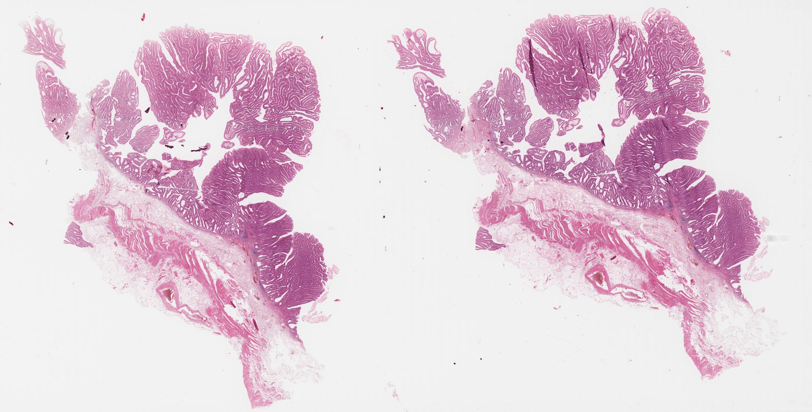
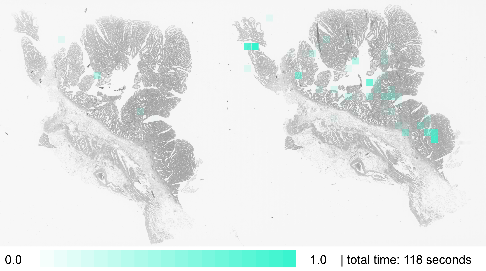
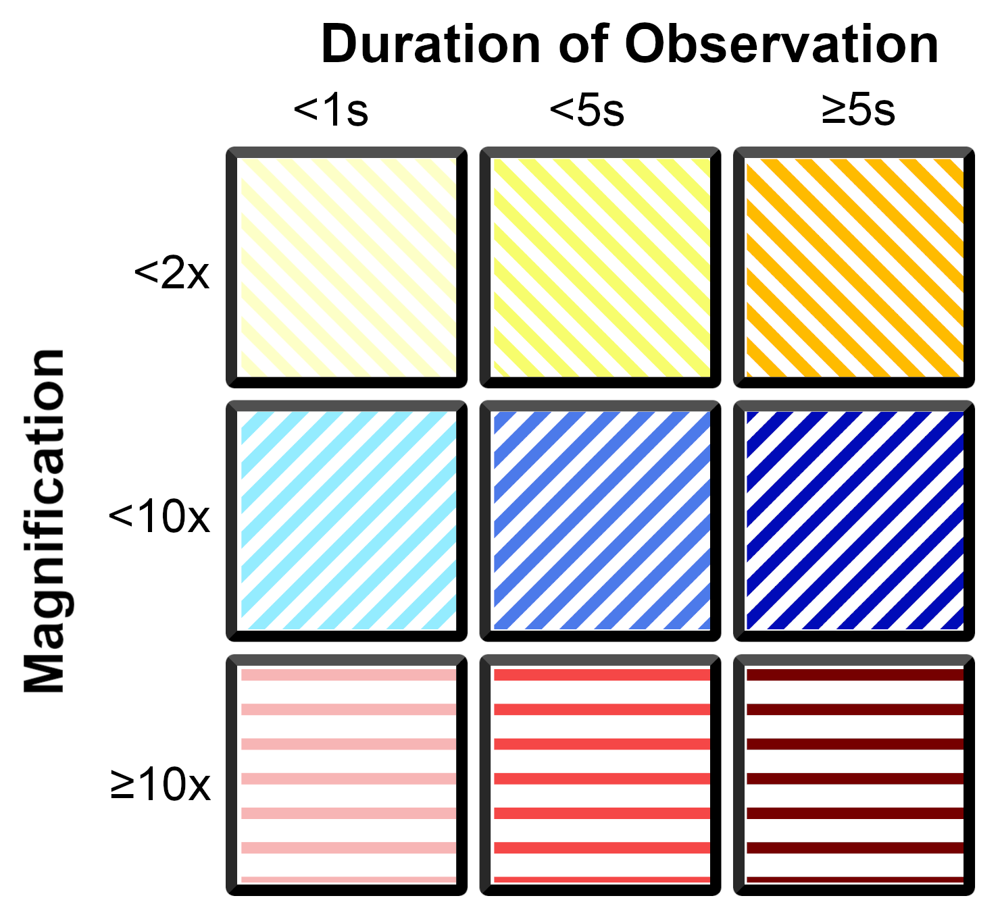

[](https://github.com/human-centered-ai-lab/SlideHeatmap/actions)


# SlideHeatmap
This software aims to render heatmap data onto an extracted histopathology whole slide image (WSI) using eye tracking data collected with [iMotions](https://imotions.com).

<details>
<summary>Here are some up to date output sample files:</summary>
<br></br>
<br></br>
<br></br>
<br></br>
<br></br>
</details>

## Installation
To setup this program you need to clone the master branch of this repository.

`git clone git@github.com:human-centered-ai-lab/SlideHeatmap.git`

Now create both a directory for input data and one for export data inside the repository.

`mkdir data export`

Then build the docker container.

```
docker build -t slide-heatmap .
```

This command may take some time to run, depending on the system. It downloads the latest Docker Python image and installs all dependencies so this does not have to be done manually. \
For writing the exported files, there will be a user and user group with the same parameters added as your current user to avoid permission errors.

-----

If you want to run this program outside of docker, you need to install the following dependencies by pip, your package manager or by source. Make sure to run at least the version listed below:
- [pixman-0.40.0](https://www.linuxfromscratch.org/blfs/view/cvs/general/pixman.html)
- [openslide-python 1.2.0](https://openslide.org/api/python/)
- [OpenSlide 3.4.1](https://openslide.org/)
- [Pillow 9.2.0](https://pillow.readthedocs.io/en/stable/)
- [pyvips 2.21](https://pypi.org/project/pyvips/)
- [numpy 1.21.5](https://numpy.org/)
- [opencv 4.6.0](https://opencv.org/)


## Usage
To draw heatmap data, a csv file with eye tracking data exported from iMotions is needed. All WSI files, on which eye tracking data have been recorded in the iMotions session, must be present inside `data` directory.

Run a new container with following parameters:

```
docker run --rm \
    -u $(id -u):$(id -g) \
    --name slide-heatmap \
    -v /absolute/path/to/data/:/data/ \
    -v /absolute/path/to/export/:/export/ \
    slide-heatmap \
    -l [EXPORT_LAYER]
```

The `-v` parameter mounts a local directory to a directory inside the container. It uses the following convention: `local_dir : container_dir`. It is important to use abolute paths for this parameter! \
Also make sure to have write permissions to the export directory!

The `-c` parameter can be skipped if no specific CSV file is desired. The container will take automatically the mounted `/data/` directory as input. If you want to specify one file, assume you are already in the mounted directory. \
All the other parameters are working like described in the table below.

With the `-u` flag a user or user and group id can be specified [`id -u` is for user, `id -u` is for group]. This solves permission issues with the exported files by running the process inside the container with this specified user. \
If you don't have a special need for this, you can leave it like it is and don't have to worry about it.

### Input parameters for SlideHeatmap and their usage:
| Option | Description |
| ------ | ----------- |
|   -c   | input CSV file or input file directory (CSV and SVS files need to be inside here). |
|   -l   | (Recommended) specify extraction layer. the extraction resolution will be read from WSI metadata. |
|   -r   | render resolution for WSI (only needed of no -l is given). |
|   -t   | specify cell size. default is 50. cells are always square. |
|   -s   | output hatched heatmap and specify alpha value of pattern. it is recommended to use a bigger cell size (~100) in combination with this option. Alpha has no default value, so specifying is necessary. Best results have been observed at around 230. |
|   -v   | enables viewpath drawing. the following parameters can be specifyed if -v is used. |
|   -p   | specify path strength. default value is 2. |
|   -i   | specify start path RGBA color. default is (127, 191, 15, 255). |
|   -j   | specify end path RGBA color. default is (15, 109, 191, 255). |
|   -u   | specify point radius. default value is 9. |
|   -o   | specify point RGBA color. default is (3, 252, 161, 230). |
|   -a   | enable cell labeling to be rendered onto exported image. |
|   -b   | enable roi labeling to be rendered onto exported image. |
|   -d   | specify heatmap background apha value in range [0-255]. |
|   -e   | enable viewPath color legend to visualise start and end colors. |
|   -f   | Specify use and threshold values for canny edge detection. Default is (100, 400). |

### Minimal native working example
To get heatmap data rendered on all WSI files used in one specific iMotions session and export all JPG's with their layer 3 resolution, use following line.

`
python3 src/main.py -c data/testMeeting.csv -l 3
`

Important to know is that a resolution with the same width/height ratio as the original WSI files has to be chosen if you specify a fixed resolution. Otherwise it is possible that only a part of the original WSI is being extracted.

> Note: Inside `data` directory must be all .csv files exported from a specific iMotions session, and all .svs files of WSIs used during this iMotions session!

When the program has finished all renderings, `done.` will be printed.

## Output Interpretation

### Region Of Interest
Uses line opacity to visualize what areas of the WSI a participant of the eye tracking session has viewed the most. The line opacity resembles the time spent observing the area, relative to the total time spent looking at this WSI. More opaque lines resemble longer time spent, more transparent lines resemble less time spent on a particular area.

The color of outlining resembles the downsample factor to which the area has been zoomed in. The more a participant of the eye tracking session has zoomed in to a specific area, the smaller the downsample factor gets. \
A rule of thumb is that bigger areas result in higher downsample factors and smaller image sections result in smaller downsample factors.

### Color Heatmap
The color heatmap draws only one color, but in different opacities. \
The opacity on each square is relative to the total time spent observing that part of the WSI. More opaque squares have been observed longer than more transparent ones.

### Hatching Heatmap
The hatching heatmap uses different hatch patterns to visualize the observation duration and magnification of areas. \
The following pattern is being used.

<br></br>


## Folder Structure
    .                           # Repository Root Folder
    ├── .vscode                 # VS Code settings (like run and debug settings)
    ├── src                     # Program Source Files
    ├── docker                  # run script for the entrypoint
    ├── templates               # holds hatching design files
    ├── images                  # Sample output images
    ├── export                  # JPG's with rendered heatmaps are exported here
    └── data                    # Stores iMotions and Whole Slide Image files

<br />

## iMotions Data

| Parameter | Description | Used For | Relative To |
|-----------|-------------|----------|-------------|
| CurrentCenterX/Y | Center of displayed image section. | - | Relative to WSI on Layer 0. |
| CurrentDownsampleFactor | Basically a inverted zoom factor. | Draw image sectoins. | Lower numbers means more "zoomed in" the displayed image section is. |
| width/heght | Width/Height of displayed image section. | Calculate dead part on recording monitor, which is the iMotions window. | Absolute pixels on display's left upper corner. |
| Top/BottomLeft/RightX/Y | Corner point coordinates of displayed image section. | Draw image sectoins. | Coordinates are on Layer 0 of WSI. |
| CenterX/Y | Center of displayed image section. | - | Coordinates are on Layer 0 of WSI. |
| ET_GazeLeft/RightX/Y | Pixel on wich eye is looking. | Drawing heatmaps and viewpath. | Coordinates on record Display. |
| ET_PupilLeft/Right | Pupil size. | - | - |
| ET_DistanceLeft/Right | Distance between Left/Right eye and eye tracker. | - | - |
| ET_CameraLeft/RightX/Y | X/Y coordinate of Left/Right eye gaze Point.  | - | Absolute pixels on display's left upper corner. |

> **_NOTE:_** This Project is currently WIP! When features are implemented they get merged into master branch.

## Citation

For more information about the motivation of the SlideHeatmap, please see the following article:

> [Understanding and Explaining Diagnostic Paths: Toward Augmented Decision Making](https://ieeexplore.ieee.org/abstract/document/9861384) <br>
> M Plass, M Kargl, P Nitsche, E Jungwirth, A Holzinger, H Müller <br>
> *IEEE Computer Graphics and Applications*, 42 (6), 47-57

If you use SlideHeatmap in your research, please cite the above article.


